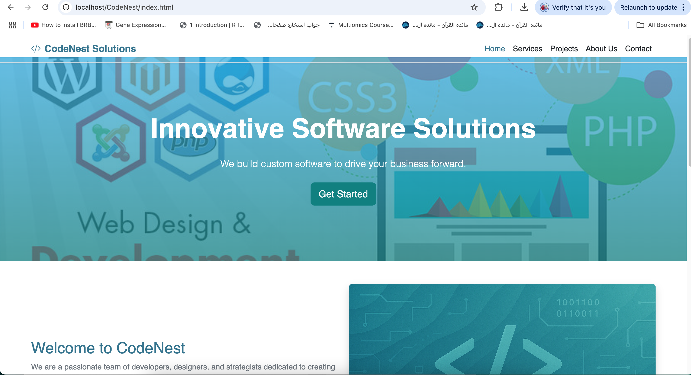
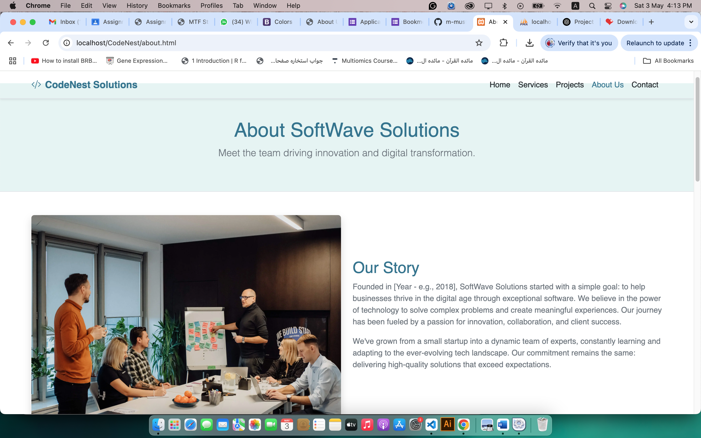
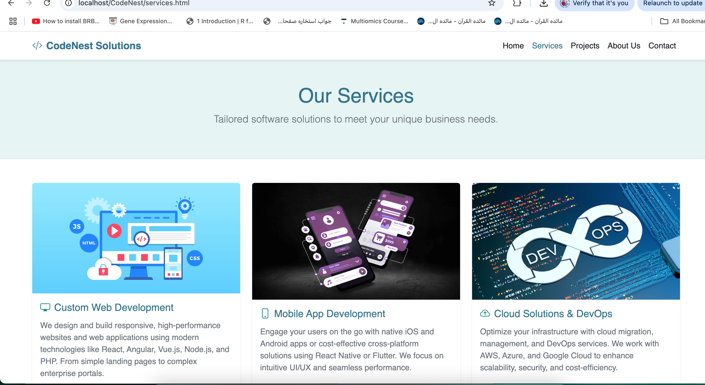
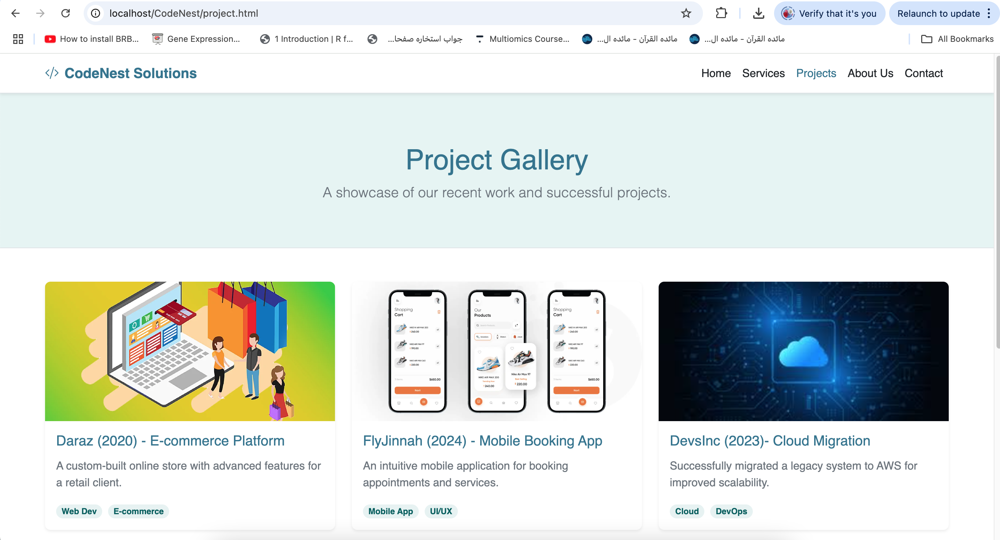
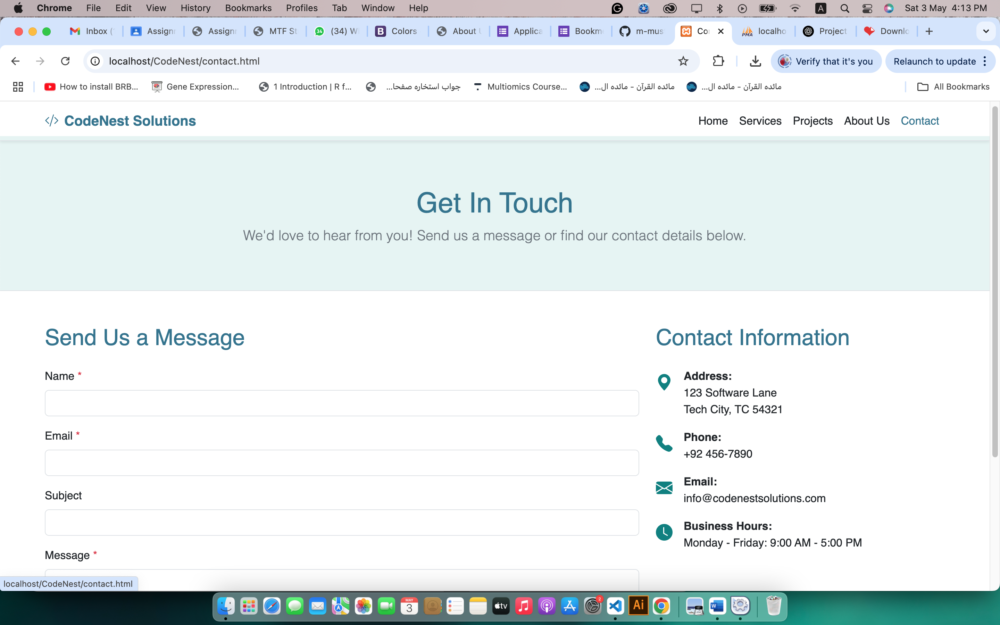

# 🚀 CodeNest Solutions Website

Welcome to the official repository for **CodeNest Solutions** — a modern, responsive, and visually appealing website designed for a software development company. This project highlights the company's services, showcases their portfolio, and provides a functional contact form for client engagement.

## 🌐 Live Preview

[🔗 View Demo](https://m-mustafa512.github.io/CodeNest-Solutions/) 

---

## 📁 Project Structure
├── index.html # Home page   
├── about.html # About Us  
├── services.html # Services Offered  
├── project.html # Portfolio  
├── contact.html # Contact Page  
├── style.css # Main CSS styles  
├── script.js # JavaScript for UI interactions  
├── form.php # Backend script to handle contact form  
└── images/ # Image assets used throughout the website    

---

## 🛠️ Technologies Used
-HTML5  
-CSS3   
-JavaScript  
-PHP  
-Bootstrap   

---

## 📸 Screenshots

### 🏠 Home Page

### ℹ️ About Page

### 🛠️ Services Page

### 💼 Projects Page

### ✉️ Contact Page

---

## ✨ Features

- ✅ Responsive design using HTML5, CSS3, and JavaScript
- ✅ Clean, modern UI with intuitive navigation
- ✅ Contact form with backend validation (PHP)
- ✅ Portfolio section with sample project thumbnails
- ✅ SEO-friendly structure and metadata

